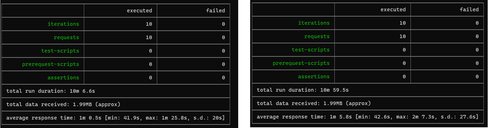
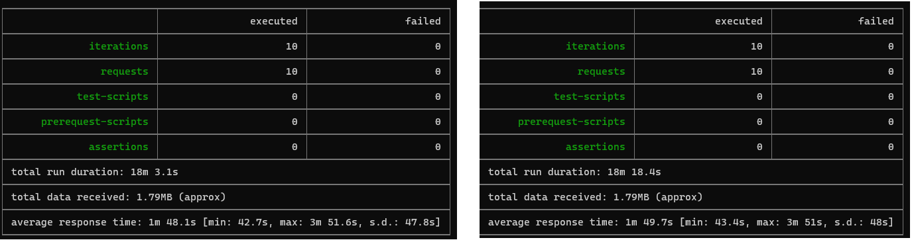

### Escuela Colombiana de Ingeniería
### Arquitecturas de Software - ARSW

## Escalamiento en Azure con Maquinas Virtuales, Sacale Sets y Service Plans

### Dependencias
* Cree una cuenta gratuita dentro de Azure. Para hacerlo puede guiarse de esta [documentación](https://azure.microsoft.com/en-us/free/search/?&ef_id=Cj0KCQiA2ITuBRDkARIsAMK9Q7MuvuTqIfK15LWfaM7bLL_QsBbC5XhJJezUbcfx-qAnfPjH568chTMaAkAsEALw_wcB:G:s&OCID=AID2000068_SEM_alOkB9ZE&MarinID=alOkB9ZE_368060503322_%2Bazure_b_c__79187603991_kwd-23159435208&lnkd=Google_Azure_Brand&dclid=CjgKEAiA2ITuBRDchty8lqPlzS4SJAC3x4k1mAxU7XNhWdOSESfffUnMNjLWcAIuikQnj3C4U8xRG_D_BwE). Al hacerlo usted contará con $200 USD para gastar durante 1 mes.

### Parte 0 - Entendiendo el escenario de calidad

Adjunto a este laboratorio usted podrá encontrar una aplicación totalmente desarrollada que tiene como objetivo calcular el enésimo valor de la secuencia de Fibonnaci.

**Escalabilidad**
Cuando un conjunto de usuarios consulta un enésimo número (superior a 1000000) de la secuencia de Fibonacci de forma concurrente y el sistema se encuentra bajo condiciones normales de operación, todas las peticiones deben ser respondidas y el consumo de CPU del sistema no puede superar el 70%.

### Escalabilidad Serverless (Functions)

1. Cree una Function App tal cual como se muestra en las  imagenes.

2. Instale la extensión de **Azure Functions** para Visual Studio Code.

3. Despliegue la Function de Fibonacci a Azure usando Visual Studio Code. La primera vez que lo haga se le va a pedir autenticarse, siga las instrucciones.

4. Dirijase al portal de Azure y pruebe la function.

5. Modifique la coleción de POSTMAN con NEWMAN de tal forma que pueda enviar 10 peticiones concurrentes. Verifique los resultados y presente un informe.

6. Cree una nueva Function que resuleva el problema de Fibonacci pero esta vez utilice un enfoque recursivo con memoization. Pruebe la función varias veces, después no haga nada por al menos 5 minutos. Pruebe la función de nuevo con los valores anteriores. ¿Cuál es el comportamiento?.

**Preguntas**

* ¿Qué es un Azure Function?
> Azure Function es una solución para ejecutar fácilmente pequeños fragmentos de código o “funciones” en la nube. Toma los conceptos básicos de los ya conocidos WebJobs y los amplía de forma interesante.
* ¿Qué es serverless?
> Es un modelo de ejecucion en el cual dejas de usar un servidor físico o uno en la nube claramente identificados por unos contenedores temporales y sin estado donde se ejecutan los códigos de las aplicaciones. Estos contenedores se crean en el momento que ejecutas la aplicación y luego desaparecen, por lo que el servidor pasa a ser una parte menos visible del sistema. Esta tecnología se asocia con FaaS que significa Function as a Service, que fue creada en 2014 por hook.io y que luego se ha ido desarrollando mediante proyectos tan importantes como Microsoft Azure Functions, IBM/Apache OpenWhisk, Google Cloud Functions o AWS Lambda.
* ¿Qué es el runtime y que implica seleccionarlo al momento de crear el Function App?
> Runtime carga todas las aplicaciones de un programa y las ejecuta en una plataforma. En este caso desde la paltaforma de Azure se tiene disponibilidad de lenguajes como .NET, Nodejs, Python, y Java. Una de las implicaciones mas importante son que dependiendo el tipo de plan que se seleccione esto afectara el tiempo de salida (timeout) y el cache.
* ¿Por qué es necesario crear un Storage Account de la mano de un Function App?
> Es necesario por el tipo de operaciones de almacenamiento y administracion que se realizan en la Funcion App.
* ¿Cuáles son los tipos de planes para un Function App?, ¿En qué se diferencias?, mencione ventajas y desventajas de cada uno de ellos.
> Consumption: Es un plan que cobra por el consumo de recursos y ejecuciones por segundo. En cuanto a su precio contiene una mensualidad gratuita de 1 millon de solicitudes y 400.000 GB de consumo. El plan Azure Funcitons Premium ofrece un mejor rendimiento y factura por segundo en funcion del consumo en funciones Premium.
> Premium plan: Ofrece las mismas funciones de escalado utilizando el plan de consumo con un mejor rendimiento y acceso a VNET. El plan Azure Functions Premium se factura en funcion del consumo de vCPU y memoria.
* ¿Por qué la memoization falla o no funciona de forma correcta?
> Esto sucede ya que en ciertos casos se genera numeros muy grandes en las peticiones, tenienod en cuenta el plan de Consumption que fue el que se escogio la memoria se llena rapido y no permite que la memorizacion funcion de una manera correcta. Otro punto de vista es que si el numero viene siendo muy grande esto podria llegar a exceder el limite de recursion que proporciona el programa.
* ¿Cómo funciona el sistema de facturación de las Function App?
> Depende del consumo de recursos y ejecuciones por segundo
* Informe
> 
>
> 
> Podemos observar que para las peticiones se tuvo un acierto del 100%, ademas que su tiempo varia entre 40 s y 1m ya que esto difiere mucho del tamano de la solicitud y nivel de procesamiento.

